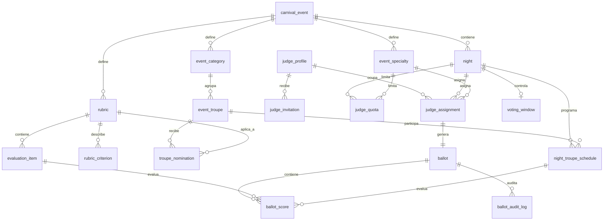

# Carnavales2027_v2

Plataforma configurable de administración y votación para Carnavales. Goya 2027 es una configuración inicial de referencia, no una restricción del producto.

## Estado del proyecto

Implementado y validado:

- **I1/I1-C:** eventos, noches, categorías, comparsas, especialidades, rubros, ítems, criterios descriptivos, readiness, apertura transaccional y administración de privilegios.
- **I2-A:** padrón de jurados, invitaciones seguras, aceptación, 2FA, suspensión/reactivación y rol `JUDGE`.
- **I2-B:** cupos por noche/especialidad, asignaciones `PRIMARY`/`SUBSTITUTE`, revocaciones, reemplazos auditados y cierre operativo de noches.
- **I3/Spec 004/Spec 006:** apertura y cierre de votación, planillas por jurado, puntuaciones por comparsa, confirmación inmutable sin nuevas reaperturas, secreto de puntajes, supervisión por `VEEDOR` y completitud obligatoria por ítem. El cierre con pendientes abre un modal administrativo con jurado, comparsa, rubro e ítem.
- **Spec 008:** invitaciones para `VEEDOR`, `COMISARIO` y `SCRUTINEER`; la emisión, inspección y aceptación API están cubiertas automáticamente. La validación de login real, 2FA y las pantallas operativas continúa pendiente.

Todavía fuera de alcance: penalizaciones, consolidación de resultados, rankings, escrutinio de resultados, actas y conexión/sincronización Offline-First. Spec 005 conserva código exploratorio, pero es una funcionalidad futura y no una capacidad operativa aceptada. La Spec 007 tiene implementación en el árbol de trabajo, pero su `spec.md` declara aprobación pendiente; su estado SDD requiere aclaración antes de considerarla aceptada.

## Próxima puerta SDD

Spec 004 mantiene activa la prevención de omisiones: cada ítem debe resolverse con 1 a 10 o `No se presentó` (0) antes de confirmar o cerrar una planilla; `PENDING` bloquea ambas operaciones. Por decisión de producto del 2026-09-01, el `5 por equidad` es nulo para planillas digitales: la plataforma impide la omisión humana que esa regla buscaba subsanar. No existe flujo, cálculo ni ajuste operativo asociado.

Conexión y sincronización Offline-First son una funcionalidad futura. Existe código exploratorio de I4-A para una outbox idempotente, conflictos de revisión y PWA de recursos estáticos, pero no está aceptado para operación ni validado manualmente. Sus artefactos históricos están en [`specs/005-offline-first/`](specs/005-offline-first/); cualquier activación, modificación o retiro requiere un nuevo ciclo SDD. Ver [`docs/sdd-status.md`](docs/sdd-status.md).

## Arquitectura

```text
api/       # Express, Better Auth, PostgreSQL y migraciones
client/    # React/Vite, panel ADMIN y vistas JUDGE
docs/      # Constitución y mapa de fuentes
specs/     # Requisitos, clarificaciones, tareas y validaciones
```

La autorización real se verifica en la API: sesión, 2FA, rol y estado del perfil. Las guardas del cliente solo orientan la experiencia de usuario.

## Estructura de base de datos

La persistencia usa PostgreSQL y está definida por las migraciones incrementales `001` a `051` en `api/src/db/migrations/`. Los estados se implementan con columnas `TEXT` y restricciones `CHECK`; no se usan tipos `ENUM` nativos. La tabla `"user"` pertenece a Better Auth y el modelo de dominio solo la referencia.

### Relaciones principales



### Tablas por dominio

| Dominio | Tablas | Estructura y relaciones relevantes |
|---|---|---|
| Autorización y auditoría | `app_role`, `user_role`, `bootstrap_state`, `audit_event`, `role_invitation` | `user_role` es la relación N:M entre usuarios Better Auth y roles. `bootstrap_state` conserva el ADMIN inicial. `audit_event` es append-only. `role_invitation` registra invitaciones operativas con vencimiento. |
| Configuración | `carnival_event`, `night`, `event_category`, `event_troupe`, `event_specialty` | Un evento contiene jornadas, categorías, comparsas y especialidades. Categorías, especialidades y comparsas están scoped por evento. |
| Evaluación | `rubric`, `evaluation_item`, `rubric_criterion`, `troupe_nomination` | Una rúbrica pertenece a un evento y tiene ítems y criterios. Cada ítem referencia una rúbrica y una especialidad del mismo evento. Las nominaciones vinculan comparsa y rúbrica del mismo evento. |
| Programación | `night_troupe_schedule`, `configuration_seed` | `night_troupe_schedule` relaciona jornada y comparsa, con orden de presentación único por jornada. `configuration_seed` registra la semilla inicial aplicada a un evento. |
| Jurados | `judge_profile`, `judge_invitation`, `judge_quota`, `judge_assignment` | El perfil de jurado referencia opcionalmente al usuario autenticado. Las invitaciones preservan su historial. Las cuotas son por jornada y especialidad; las asignaciones relacionan jurado, evento, jornada y especialidad. |
| Votación | `ballot`, `ballot_score`, `voting_window`, `ballot_audit_log`, `ballot_sync_operation` | Una planilla corresponde a una asignación de jurado. Cada score relaciona planilla, ítem evaluable y comparsa programada. La ventana controla la votación de una jornada. La auditoría y el ledger de sincronización son append-only. |
| Histórico | `ballot_score_subsanation` | Conserva subsanaciones históricas de 5 puntos; no existe flujo operativo vigente que cree nuevas subsanaciones. |

### Estados y restricciones

| Entidad | Estados o valores válidos |
|---|---|
| `carnival_event` | `CONFIGURING`, `OPEN` |
| `night` | Tipo `COMPETITION` o `AWARDS`; estado `DRAFT`, `OPEN` o `CLOSED` |
| `judge_profile` | `INVITED`, `REGISTERED`, `SUSPENDED` |
| `judge_invitation` | Estado `PENDING`, `USED`, `REVOKED`; entrega `PENDING`, `SENT`, `FAILED` |
| `judge_assignment` | Estado `ACTIVE`, `REVOKED`; tipo `PRIMARY`, `SUBSTITUTE` |
| `ballot` | `OPEN`, `SUBMITTED`; `REOPENED` solo para finalización de registros históricos |
| `ballot_score.status` | `DRAFT`, `LOCKED` |
| `ballot_score.evaluation_state` | `PENDING` con score `NULL`; `SCORED` con 1 a 10; `NOT_PRESENTED` con 0 |
| `voting_window` | `OPEN`, `CLOSED` |

### Invariantes de integridad

- Un evento contiene jornadas, categorías, comparsas, especialidades, rúbricas e ítems propios; no se admite reasignarlos entre eventos.
- La configuración solo cambia mientras el evento está `CONFIGURING`; tras abrirse queda protegida por guards de base de datos.
- Una comparsa no puede repetirse ni compartir orden de presentación dentro de una jornada.
- Un jurado solo puede tener una asignación activa por jornada, y las asignaciones activas no pueden exceder el cupo de jornada y especialidad.
- Una planilla debe coincidir con una asignación activa en jurado, evento, jornada y especialidad.
- Un score es único por planilla, ítem evaluable y comparsa programada; el ítem, rúbrica, especialidad y jornada deben pertenecer al mismo contexto de evento.
- **[NECESITA ACLARACIÓN] Spec 007:** el código del árbol de trabajo bloquea decisiones por ítem, pero su spec declara aprobación pendiente. No se debe tratar como requisito SDD aceptado hasta resolver esa discrepancia.
- Las planillas confirmadas son inmutables; no existen nuevas reaperturas. Una planilla histórica ya `REOPENED` solo puede finalizar en `SUBMITTED`.
- Los scores `PENDING` bloquean confirmar la planilla y cerrar la votación; la combinación de estado semántico y score se valida en PostgreSQL.
- La auditoría, perfiles, invitaciones, asignaciones, planillas y scores conservan historia y no admiten borrado físico operativo.
- No se puede eliminar ni degradar al último `ADMIN` activo.

El código exploratorio de I4-A conserva la revisión de planilla y el ledger `ballot_sync_operation`, pero Offline/sync continúa fuera del alcance operativo hasta contar con un incremento SDD futuro. Penalizaciones, consolidación de resultados, rankings, desempate, escrutinio y actas también continúan fuera de alcance.

## Requisitos

- Node.js 20 o superior.
- PostgreSQL 14 o superior.
- Dos bases PostgreSQL separadas para desarrollo y pruebas.

## Instalación local

Instalar dependencias en ambos módulos:

```bash
cd api && npm ci
cd ../client && npm ci
```

Crear `api/.env` a partir de [`api/.env.example`](api/.env.example), completar las conexiones PostgreSQL y generar un secreto local:

```bash
openssl rand -base64 32
```

Configurar el resultado como `BETTER_AUTH_SECRET`. Luego, desde `api/`:

```bash
npm run auth:migrate
npm run db:migrate
NODE_ENV=development npm run db:seed
NODE_ENV=development npm run db:seed:goya
npm run dev
```

El seed ADMIN usa `SEED_ADMIN_EMAIL`, `SEED_ADMIN_NAME` y `SEED_ADMIN_PASSWORD`. El seed de Goya crea solo datos iniciales sugeridos: evento, noches, categoría y especialidades; no crea comparsas, rubros ni ítems completos.

En otra terminal, desde `client/`:

```bash
npm run dev
```

Abrir `http://localhost:5173/#/login`. En desarrollo, Vite redirige `/api` a `http://localhost:3000` y conserva el flujo same-origin.

## Roles y rutas de cliente

- `#/admin/events`: configuración y apertura de eventos.
- `#/admin/judges`: padrón e invitaciones de jurados.
- `#/admin/assignments`: cupos, asignaciones y reemplazos.
- `#/admin/voting`: apertura, cierre y estado de planillas; un cierre bloqueado lista los votos pendientes en un modal.
- `#/admin/users`: listado e invitación de accesos operativos.
- `#/judge`: consulta de asignaciones y planillas propias.
- `#/judge/ballot?ballotId=:ballotId`: carga y confirmación de una planilla propia.
- `#/invitations/accept`: aceptación de invitaciones.
- `#/invitations/role/accept?token=:token`: aceptación de invitaciones operativas.

Las rutas protegidas requieren 2FA verificado. `ADMIN` administra el sistema; `JUDGE` solo accede a sus asignaciones activas y planillas propias; `VEEDOR` ve conteos operativos sin puntajes.

## API principal

La API expone, entre otros, estos contratos bajo `/api/v1`:

- `GET /me`
- `GET /users`
- `POST /users/invitations`
- `GET /invitations/role/:token`
- `POST /invitations/role/accept`
- `GET/POST /judges`
- `POST /judges/:judgeId/invitations`
- `POST /judges/:judgeId/suspend`
- `POST /judges/:judgeId/reactivate`
- `GET /events/:eventId/judge-assignments`
- `PUT /events/:eventId/nights/:nightId/specialties/:specialtyId/judge-quota`
- `POST /events/:eventId/judge-assignments`
- `POST /judge-assignments/:assignmentId/revoke`
- `POST /judge-assignments/:assignmentId/replace`
- `GET /judge/assignments`
- `GET /judge/ballots`
- `GET /judge/ballots/:ballotId`
- `PUT /judge/ballots/:ballotId/scores/:scoreId`
- `POST /judge/ballots/:ballotId/submit`
- `POST /judge/ballots/:ballotId/sync`
- `POST /events/:eventId/nights/:nightId/voting/open`
- `POST /events/:eventId/nights/:nightId/voting/close`
- `GET /events/:eventId/nights/:nightId/voting/status`
- `GET /events/:eventId/nights/:nightId/voting/ballots`

Cada ítem de planilla permanece en `PENDING`, recibe un puntaje ordinario `SCORED` de 1 a 10, o se marca mediante la acción independiente `NOT_PRESENTED` con valor efectivo 0. Si el jurado intenta confirmar con pendientes, recibe un modal bloqueante que los identifica por comparsa, rubro e ítem. Los pendientes también bloquean el cierre administrativo y abren un modal con jurado, comparsa, rubro e ítem faltante. Una planilla confirmada no se puede reabrir. Las subsanaciones históricas se conservan; su operación pertenece al futuro incremento de escrutinio.

## Producción

Antes de iniciar producción:

```bash
npm run auth:migrate
npm run db:migrate
npm run bootstrap:admin
npm start
```

El bootstrap requiere `BOOTSTRAP_ADMIN_EMAIL`, `BOOTSTRAP_ADMIN_NAME` y `BOOTSTRAP_ADMIN_PASSWORD`, y solo puede ejecutarse una vez. Producción requiere `EMAIL_PROVIDER=smtp`, `SMTP_*`, `EMAIL_FROM`, `BETTER_AUTH_URL`, `FRONTEND_URL`, HTTPS y un secreto fuerte.

El cliente no es servido por la API. En producción se necesita un reverse proxy o servidor same-origin que sirva el cliente y reenvíe `/api` a la API; el proxy de Vite es solo para desarrollo.

## Validación

Desde `api/`:

```bash
npm test
npm run db:test
npm run db:migrate -- --status
npm audit
```

Desde `client/`:

```bash
npm test
npm run build
npm audit
```

Las pruebas PostgreSQL requieren que `TEST_DATABASE_URL` apunte a una base aislada. La evidencia detallada está en [`specs/002-jurados-asignaciones/validation.md`](specs/002-jurados-asignaciones/validation.md), [`specs/004-completitud-planillas/validation.md`](specs/004-completitud-planillas/validation.md), [`specs/005-offline-first/validation.md`](specs/005-offline-first/validation.md), [`specs/006-cierre-sin-reapertura/validation.md`](specs/006-cierre-sin-reapertura/validation.md) y [`specs/008-gestion-accesos/validation.md`](specs/008-gestion-accesos/validation.md).

## SDD y seguridad

- [Constitución](docs/constitution.md)
- [Mapa de fuentes](docs/source-map.md)
- [Spec 001](specs/001-plataforma-votacion-carnavales/spec.md)
- [Clarificaciones](specs/001-plataforma-votacion-carnavales/clarifications.md)
- [Tareas I1](specs/001-plataforma-votacion-carnavales/tasks.md)
- [Spec 002](specs/002-jurados-asignaciones/spec.md)
- [Validación I2](specs/002-jurados-asignaciones/validation.md)
- [Plan I2-B](.hermes/plans/2026-08-30_i2-b-cupos-asignaciones.md)
- [Spec 003](specs/003-votacion-planillas/spec.md)
- [Clarificaciones I3](specs/003-votacion-planillas/clarifications.md)
- [Tareas I3](specs/003-votacion-planillas/tasks.md)
- [Validación I3](specs/003-votacion-planillas/validation.md)
- [Plan I3](.hermes/plans/2026-08-30_i3-votacion-planillas.md)
- [Spec 004](specs/004-completitud-planillas/spec.md)
- [Clarificaciones Spec 004](specs/004-completitud-planillas/clarifications.md)
- [Tareas Spec 004](specs/004-completitud-planillas/tasks.md)
- [Plan Spec 004](.hermes/plans/2026-08-30_completitud-planillas.md)
- [Validación Spec 004](specs/004-completitud-planillas/validation.md)
- [Spec 005 - Offline-First](specs/005-offline-first/spec.md)
- [Clarificaciones Spec 005](specs/005-offline-first/clarifications.md)
- [Tareas Spec 005](specs/005-offline-first/tasks.md)
- [Plan Spec 005](.hermes/plans/2026-08-31_i4-a-offline-first.md)
- [Validación Spec 005](specs/005-offline-first/validation.md)
- [Spec 006 - Cierre sin reapertura](specs/006-cierre-sin-reapertura/spec.md)
- [Clarificaciones Spec 006](specs/006-cierre-sin-reapertura/clarifications.md)
- [Tareas Spec 006](specs/006-cierre-sin-reapertura/tasks.md)
- [Plan Spec 006](.hermes/plans/2026-08-31_cierre-sin-reapertura.md)
- [Validación Spec 006](specs/006-cierre-sin-reapertura/validation.md)
- [Spec 007 - Inmutabilidad por ítem](specs/007-inmutabilidad-por-item/spec.md)
- [Clarificaciones Spec 007](specs/007-inmutabilidad-por-item/clarifications.md)
- [Tareas Spec 007](specs/007-inmutabilidad-por-item/tasks.md)
- [Plan Spec 007](specs/007-inmutabilidad-por-item/plan.md)
- [Spec 008 - Gestión de accesos](specs/008-gestion-accesos/spec.md)
- [Clarificaciones Spec 008](specs/008-gestion-accesos/clarifications.md)
- [Plan Spec 008](specs/008-gestion-accesos/plan.md)
- [Tareas Spec 008](specs/008-gestion-accesos/tasks.md)
- [Validación Spec 008](specs/008-gestion-accesos/validation.md)

No commitear `.env`, contraseñas, tokens ni secretos. No existe autoasignación pública de `ADMIN`. La seguridad del sistema se aplica del lado del servidor.
