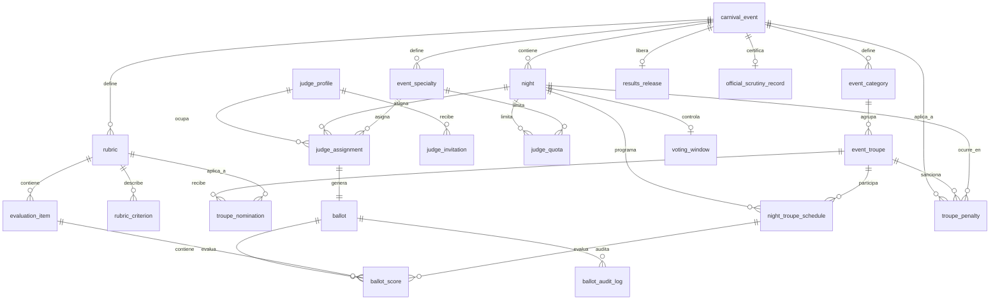

# Carnavales2027_v2

Plataforma configurable de administración y votación para Carnavales. Goya 2027 es una configuración inicial de referencia, no una restricción del producto.

## Estado del proyecto

Implementado y validado:

- **I1/I1-C:** eventos, noches, categorías, comparsas, especialidades, rubros, ítems, criterios descriptivos, readiness, apertura transaccional y administración de privilegios.
- **I2-A:** padrón de jurados, invitaciones seguras, aceptación, 2FA, suspensión/reactivación y rol `JUDGE`.
- **I2-B:** cupos por noche/especialidad, asignaciones `PRIMARY`/`SUBSTITUTE`, revocaciones, reemplazos auditados y cierre operativo de noches.
- **I3/Spec 004/Spec 006:** apertura y cierre de votación, planillas por jurado, puntuaciones por comparsa, confirmación inmutable sin nuevas reaperturas, secreto de puntajes, supervisión por `VEEDOR` y completitud obligatoria por ítem. El cierre con pendientes abre un modal administrativo con jurado, comparsa, rubro e ítem.
- **Spec 007:** confirmación e inmutabilidad inmediata por ítem, con modal de decisión y controles bloqueados tras confirmar. Validada automáticamente y con comprobación manual responsive.
- **Spec 008:** invitaciones de un solo uso para `VEEDOR`, `COMISARIO` y `SCRUTINEER`, persistidas solo como hash. La emisión, inspección, aceptación, login real, 2FA y la UI responsive están validados. Las altas se gestionan desde Personas.
- **Spec 009:** rediseño operativo oscuro del jurado, validado automáticamente y con comprobación manual. Cerrada.
- **Spec 010:** consolidación de resultados, rankings, desempate por criterios 1 y 2, y guardias de integridad de liberación (RF-94a). Cerrada.
- **Spec 011:** sorteo ceremonial con `crypto.randomInt()`, auditoría encadenada e interfaz de escrutinio, con comprobación manual en 3 viewports. Cerrada.
- **Spec 012:** planilla online únicamente; retira el uso operativo de outbox y cache local en el cliente actual, con comprobación manual. Cerrada.
- **Spec 013:** suplencias priorizadas: pares fijos titular/suplente, activación ADMIN+2FA con motivo ante titular incompleto o ausente, transición `REPLACED` y preservación histórica sin bloqueo de cierre ni liberación. Cerrada.
- **Spec 014:** gestión de penalizaciones (`troupe_penalty`): deducción reglamentaria en Mejor Comparsa con piso en cero, preservación de rubros artísticos (RF-118), panel accesible de Comisariato, revocación auditada y bloqueo tras liberación de resultados. Cerrada el 2026-09-03.
- **Spec 015:** actas oficiales y certificación de escrutinio (`official_scrutiny_record`): sello criptográfico JCS/SHA-256 (RFC 8785), inmutabilidad estricta por triggers en BD, segregación estricta de funciones (ADMIN solo lectura; emisión exclusiva `SCRUTINEER`/`ESCRIBANO` con 2FA) y vista notarial imprimible (`@media print`). Cerrada el 2026-09-03.
- **Perfiles Operativos:** alta unificada de roles auxiliares (VEEDOR, COMISARIO, SCRUTINEER, ESCRIBANO), invitación por consola/SMTP, aceptación solo password, ciclo de vida `INVITED→REGISTERED→SUSPENDED`. Migraciones 064-065. Implementado y validado (99 tests) el 2026-09-03.
- **Spec 017:** configuración ampliada de competencia: metadata y criterios por ítem, integridad histórica, reordenamiento de ítems/criterios, color de comparsa y orden de pasada por jornada. T09a/T09b tienen evidencia automatizada; T04 y decisiones de apertura/versionado permanecen pendientes.
- **Specs 019–024:** seguridad de plataforma, sistema de diseño, planilla v3, SSE, home por rol y portal público de resultados. Cerradas y validadas según sus `validation.md`.
- **Divergencia Spec 023:** la validación histórica contempla `HomePage.jsx`/`#/home`, pero el estado actual del working tree usa aterrizajes directos por rol y `#/admin/home`; queda `[NECESITA ACLARACIÓN]` antes de considerarse una decisión de producto cerrada.
- **Spec 027:** rediseño UX admin, dashboard, evento activo global, separación Eventos/Competencia y catálogo visual de eventos. G0–G4 validadas automáticamente; comprobación manual responsive/teclado/táctil pendiente.

Todavía fuera de alcance: conexión/sincronización Offline-First operativa. Spec 005 conserva compatibilidad exploratoria para clientes antiguos, pero no es una capacidad operativa aceptada.

## Incremento vigente

Spec 027 — Rediseño UX del panel ADMIN está implementado y validado automáticamente. Permanece abierta la comprobación manual en 390×844, 768×1024 y 1440×900, con teclado y emulación táctil. También continúan pendientes Spec 026 T11 y la comprobación responsive de Spec 016. La evidencia detallada se registra en `docs/sdd-status.md` y `specs/027-admin-ux-redesign/validation.md`.

## Próxima puerta SDD

La próxima puerta de validación es manual: responsive, teclado y táctil de las pantallas ADMIN. Las reglas operativas de Spec 004 siguen activas: cada ítem debe resolverse con 1 a 10 o `No se presentó` (0) antes de confirmar o cerrar una planilla; `PENDING` bloquea ambas operaciones. El `5 por equidad` es nulo para planillas digitales.

Conexión y sincronización Offline-First son una funcionalidad futura. Existe código exploratorio de I4-A para una outbox idempotente, conflictos de revisión y PWA de recursos estáticos, pero no está aceptado para operación ni validado manualmente. Sus artefactos históricos están en [`specs/005-offline-first/`](specs/005-offline-first/); cualquier activación, modificación o retiro requiere un nuevo ciclo SDD. Ver [`docs/sdd-status.md`](docs/sdd-status.md).

## Arquitectura

```text
api/       # Express, Better Auth, PostgreSQL y migraciones
client/    # React/Vite, panel ADMIN y vistas JUDGE
docs/      # Constitución y mapa de fuentes
specs/     # Requisitos, clarificaciones, tareas y validaciones
```

La autorización real se verifica en la API: sesión, 2FA, rol y estado del perfil. Las guardas del cliente solo orientan la experiencia de usuario.

## Estructura de base de datos

La persistencia usa PostgreSQL y está definida por las migraciones incrementales hasta `072` en `api/src/db/migrations/`. Los estados se implementan con columnas `TEXT` y restricciones `CHECK`; no se usan tipos `ENUM` nativos. La tabla `"user"` pertenece a Better Auth y el modelo de dominio solo la referencia.

### Relaciones principales



### Tablas por dominio

| Dominio | Tablas | Estructura y relaciones relevantes |
|---|---|---|
| Autorización y auditoría | `app_role`, `user_role`, `bootstrap_state`, `audit_event`, `role_invitation`, `operational_profile`, `operational_invitation` | `user_role` es la relación N:M entre usuarios Better Auth y roles. `bootstrap_state` conserva el ADMIN inicial. `audit_event` es append-only. `role_invitation` conserva solo el hash, estado y vencimiento de cada invitación operativa. `operational_profile` y `operational_invitation` soportan roles auxiliares (VEEDOR, COMISARIO, SCRUTINEER, ESCRIBANO). |
| Configuración | `carnival_event`, `night`, `event_category`, `event_troupe`, `event_specialty` | Un evento contiene jornadas, categorías, comparsas y especialidades. Categorías, especialidades y comparsas están scoped por evento. |
| Evaluación | `rubric`, `evaluation_item`, `rubric_criterion`, `troupe_nomination` | Una rúbrica pertenece a un evento y tiene ítems y criterios. Cada ítem referencia una rúbrica y una especialidad del mismo evento. Las nominaciones vinculan comparsa y rúbrica del mismo evento. |
| Programación | `night_troupe_schedule`, `configuration_seed` | `night_troupe_schedule` relaciona jornada y comparsa, con orden de presentación único por jornada. `configuration_seed` registra la semilla inicial aplicada a un evento. |
| Jurados | `judge_profile`, `judge_invitation`, `judge_quota`, `judge_assignment` | El perfil de jurado referencia opcionalmente al usuario autenticado. Las invitaciones preservan su historial. Las cuotas son por jornada y especialidad; las asignaciones relacionan jurado, evento, jornada y especialidad. |
| Votación | `ballot`, `ballot_score`, `voting_window`, `ballot_audit_log`, `ballot_sync_operation` | Una planilla corresponde a una asignación de jurado. Cada score relaciona planilla, ítem evaluable y comparsa programada. La ventana controla la votación de una jornada. La auditoría y el ledger de sincronización son append-only. |
| Comisariato y sanciones | `troupe_penalty` | Sanciones en puntos descontables de Mejor Comparsa. Con contexto de evento, comparsa y noche competitiva. Bloqueada contra mutación o revocación post-liberación. |
| Escrutinio y actas | `results_release`, `official_scrutiny_record` | `results_release` registra la liberación oficial por SCRUTINEER/ESCRIBANO. `official_scrutiny_record` almacena el acta notarial sellada con hash JCS/SHA-256 e inmutable a nivel de base de datos. |
| Histórico | `ballot_score_subsanation` | Conserva subsanaciones históricas de 5 puntos; no existe flujo operativo vigente que cree nuevas subsanaciones. |

### Estados y restricciones

| Entidad | Estados o valores válidos |
|---|---|
| `carnival_event` | `CONFIGURING`, `OPEN` |
| `night` | Tipo `COMPETITION` o `AWARDS`; estado `DRAFT`, `OPEN` o `CLOSED` |
| `judge_profile` | `INVITED`, `REGISTERED`, `SUSPENDED` |
| `judge_invitation` | Estado `PENDING`, `USED`, `REVOKED`; entrega `PENDING`, `SENT`, `FAILED` |
| `role_invitation` | Estado `PENDING`, `USED`, `REVOKED`; token persistido solo como hash |
| `judge_assignment` | Estado `ACTIVE`, `REVOKED`; tipo `PRIMARY`, `SUBSTITUTE` |
| `ballot` | `OPEN`, `SUBMITTED`; `REOPENED` solo para finalización de registros históricos |
| `ballot_score.status` | `DRAFT`, `LOCKED` |
| `ballot_score.evaluation_state` | `PENDING` con score `NULL`; `SCORED` con 1 a 10; `NOT_PRESENTED` con 0 |
| `troupe_penalty.status` | `APPLIED`, `REVOKED` |
| `official_scrutiny_record.certified_role` | `SCRUTINEER`, `ESCRIBANO` (inmutable tras inserción) |
| `operational_profile` | `INVITED`, `REGISTERED`, `SUSPENDED` |
| `operational_invitation` | Estado `PENDING`, `USED`, `REVOKED`; entrega `PENDING`, `SENT`, `FAILED` |
| `voting_window` | `OPEN`, `CLOSED` |

### Invariantes de integridad

- Un evento contiene jornadas, categorías, comparsas, especialidades, rúbricas e ítems propios; no se admite reasignarlos entre eventos.
- La configuración solo cambia mientras el evento está `CONFIGURING`; tras abrirse queda protegida por guards de base de datos.
- Una comparsa no puede repetirse ni compartir orden de presentación dentro de una jornada.
- Un jurado solo puede tener una asignación activa por jornada, y las asignaciones activas no pueden exceder el cupo de jornada y especialidad.
- Una planilla debe coincidir con una asignación activa en jurado, evento, jornada y especialidad.
- Un score es único por planilla, ítem evaluable y comparsa programada; el ítem, rúbrica, especialidad y jornada deben pertenecer al mismo contexto de evento.
- La Spec 007 deroga el RF-62 de Spec 004: toda decisión confirmada por el jurado para un ítem queda inmutable y ya no puede volver a `PENDING`.
- Las planillas confirmadas son inmutables; no existen nuevas reaperturas. Una planilla histórica ya `REOPENED` solo puede finalizar en `SUBMITTED`.
- Los scores `PENDING` bloquean confirmar la planilla y cerrar la votación; la combinación de estado semántico y score se valida en PostgreSQL.
- La auditoría, perfiles, invitaciones, asignaciones, planillas y scores conservan historia y no admiten borrado físico operativo.
- No se puede eliminar ni degradar al último `ADMIN` activo.

El código exploratorio de I4-A conserva la revisión de planilla y el ledger `ballot_sync_operation`, pero Offline/sync continúa fuera del alcance operativo hasta contar con un incremento SDD futuro.

## Requisitos

- Node.js **24 LTS recomendado**. Vite requiere Node 20.19+ en la rama 20, o 22.12+ en ramas posteriores.
- PostgreSQL 14 o superior, instalado y en ejecución.
- Dos bases PostgreSQL separadas para desarrollo y pruebas.
- Dos terminales: una para la API y otra para el cliente.

## Primera instalación local

Los siguientes pasos usan **Windows PowerShell**. Se utiliza `npm.cmd` para
evitar el bloqueo de `npm.ps1` por la política de ejecución de Windows.
En Linux/macOS, usar `npm` y `export NODE_ENV=development` en lugar de
`$env:NODE_ENV = "development"`.

### 1. Instalar dependencias

Desde la **raíz del repositorio**, donde están las carpetas `api/` y `client/`:

```powershell
npm.cmd --prefix api ci
npm.cmd --prefix client ci
```

### 2. Preparar PostgreSQL

Crear dos bases vacías desde pgAdmin o mediante `createdb`, usando un usuario
PostgreSQL con permiso para crearlas. Por ejemplo, si usás el usuario `postgres`
y las herramientas de PostgreSQL están en el PATH:

```powershell
createdb -U postgres carnavales2027_v2
createdb -U postgres carnavales2027_v2_test
```

Si las bases ya existen, continuar con el siguiente paso. La aplicación se
conecta a la base de desarrollo mediante `DATABASE_URL`; las pruebas usan
`TEST_DATABASE_URL`.

### 3. Configurar `api/.env`

Desde la raíz, copiar el ejemplo si todavía no existe una configuración local:

```powershell
if (-not (Test-Path -LiteralPath ".\api\.env")) {
  Copy-Item -LiteralPath ".\api\.env.example" -Destination ".\api\.env"
}
```

Editar `api/.env` y completar estas variables. Las variables
de seed aparecen comentadas en el ejemplo: quitar su `#` para activarlas.

| Variable | Configuración local |
|---|---|
| `DATABASE_URL` | Conexión PostgreSQL a `carnavales2027_v2`, con tu usuario y contraseña reales |
| `TEST_DATABASE_URL` | Conexión a la base separada `carnavales2027_v2_test` |
| `BETTER_AUTH_SECRET` | Secreto aleatorio generado localmente; reemplazar el placeholder |
| `BETTER_AUTH_URL` | `http://localhost:3000` |
| `FRONTEND_URL` | `http://localhost:5173` |
| `EMAIL_PROVIDER` | `console` |
| `TRUST_PROXY` | `0` |
| `SEED_ADMIN_EMAIL` | Correo con el que ingresarás como ADMIN |
| `SEED_ADMIN_NAME` | Nombre visible del ADMIN |
| `SEED_DEMO_PASSWORD` | Contraseña común de las cuentas del fixture, de 8 a 128 caracteres |

Si omitís `SEED_DEMO_PASSWORD`, definir `SEED_ADMIN_PASSWORD`: el seed integral
la usa como contraseña común. Guardar contraseñas y conexiones solamente en
`api/.env`, que no se versiona.

Para generar el secreto de Better Auth con Node y copiarlo al portapapeles:

```powershell
node -e "process.stdout.write(require('node:crypto').randomBytes(32).toString('hex'))" | Set-Clipboard
```

Pegar el resultado como valor de `BETTER_AUTH_SECRET` en `api/.env`.

### 4. Crear las tablas y cargar el evento integral

Desde la raíz, entrar en `api/`. Los comandos de la API deben ejecutarse allí
para que `dotenv` encuentre `api/.env`.

```powershell
Set-Location .\api
$env:NODE_ENV = "development"
npm.cmd run auth:migrate
npm.cmd run seed:event:full
```

`auth:migrate` crea las tablas de Better Auth. `seed:event:full` aplica las
migraciones de dominio y carga **Carnavales Goyanos 2027 - Evento Integral TEST**:
tres jornadas, siete comparsas, nueve jurados asignados, 36 rubros, orden de
pasadas, horarios y cuentas ADMIN/ESCRIBANO/VEEDOR.

**`seed:event:full` es el único seed del proyecto.** Incluye toda la
configuración y las cuentas del fixture; no hay seeds complementarios que ejecutar.

El seed deja el evento **configurado, sin iniciar y sin votos**. Su salida debe
incluir `Evento listo para comenzar (CONFIGURING; readiness válido)`.

### 5. Iniciar API y cliente

**Terminal 1 — API**, continuando dentro de `api/`:

```powershell
npm.cmd run dev
```

Debe mostrar `API listening on http://localhost:3000`. Mantener esta terminal
abierta: con `EMAIL_PROVIDER=console`, los códigos OTP de desarrollo aparecen
en ella cuando se solicitan desde el login.

**Terminal 2 — cliente**, abriendo otra terminal en la raíz del repositorio:

```powershell
Set-Location .\client
npm.cmd run dev -- --port 5173 --strictPort
```

Abrir **http://localhost:5173/#/login**. Vite reenvía `/api` a
`http://localhost:3000`; el cliente y la API deben estar ejecutándose a la vez.

### 6. Ingresar y comenzar la competencia

1. Ingresar con el correo de `SEED_ADMIN_EMAIL` y la contraseña común configurada.
2. Completar la habilitación/verificación 2FA que solicite la pantalla. Obtener
   el OTP en la terminal de la API cuando el proveedor local sea `console`.
3. Seleccionar **Carnavales Goyanos 2027 - Evento Integral TEST** en Eventos.
4. Revisar jornadas, comparsas, asignaciones y orden de pasada. Abrir el evento.
5. Pasar la jornada elegida de `DRAFT` a `OPEN` mediante la API autenticada
   (procedimiento debajo). Actualmente `NightForm` no expone el estado y
   **Abrir votación** exige que la jornada ya esté `OPEN`.
6. Recargar la aplicación, ir a Control de votación, seleccionar evento y
   jornada y pulsar **Abrir votación**. Se generan las tres planillas de sus
   jurados con ítems `PENDING`.
7. Cada jurado ingresa con su correo de la tabla del evento integral, la contraseña común
   y su propio OTP. Las otras jornadas siguen sin planillas hasta su apertura.

<details>
<summary>Procedimiento actual para abrir una jornada por API (ADMIN con 2FA)</summary>

Después de abrir el evento desde la aplicación, ejecutar este fragmento en
la consola de desarrollador del navegador, sobre `http://localhost:5173`,
con la sesión ADMIN ya verificada. Utiliza la cookie de la sesión sin copiar
tokens. Cambiar `numeroJornada` para elegir otra jornada del fixture.

```javascript
const numeroJornada = 1;
async function solicitar(path, options = {}) {
  const response = await fetch(`/api/v1${path}`, {
    credentials: "include",
    ...options,
    headers: { "Content-Type": "application/json" },
  });
  const data = await response.json();
  if (!response.ok) throw new Error(data.code ?? `HTTP ${response.status}`);
  return data;
}
const evento = (await solicitar("/events")).find(
  (entry) => entry.name === "Carnavales Goyanos 2027 - Evento Integral TEST",
);
if (!evento || evento.status !== "OPEN") throw new Error("Abrir primero el evento desde la aplicación.");
const jornada = (await solicitar(`/events/${evento.id}/nights`)).find(
  (entry) => entry.displayOrder === numeroJornada,
);
if (!jornada) throw new Error("Jornada no encontrada.");
await solicitar(`/nights/${jornada.id}`, {
  method: "PATCH",
  body: JSON.stringify({
    name: jornada.name,
    displayOrder: jornada.displayOrder,
    kind: jornada.kind,
    eventDate: jornada.eventDate?.slice(0, 10) ?? null,
    status: "OPEN",
  }),
});
```

Este paso abre el estado de la jornada. La creación de planillas ocurre
después, al pulsar **Abrir votación** en Control de votación. La API conserva
sus verificaciones de sesión, ADMIN, 2FA y transiciones válidas.

</details>

## Arranque diario (proyecto ya instalado)

Con PostgreSQL en ejecución, abrir dos terminales desde la raíz.

**API:**

```powershell
Set-Location .\api
$env:NODE_ENV = "development"
npm.cmd run dev
```

**Cliente:**

```powershell
Set-Location .\client
npm.cmd run dev -- --port 5173 --strictPort
```

Ingresar en **http://localhost:5173/#/login**. Para detener cada proceso, usar
`Ctrl+C` en su terminal.

Los datos permanecen en PostgreSQL. **No repetir el seed en cada arranque**:
rechaza eventos ya iniciados o modificados y cierra las sesiones de sus cuentas.
Después de incorporar nuevas migraciones del repositorio, ejecutar
`npm.cmd run db:migrate` desde `api/` antes de levantar la API.

### Comprobaciones rápidas

- **API disponible:** abrir `http://localhost:3000/health`.
- **Error de conexión a BD:** verificar PostgreSQL en ejecución, base creada y
  credenciales/puerto de `DATABASE_URL`.
- **Variable de seed requerida:** revisar que esté definida sin `#` en
  `api/.env` y ejecutar el comando desde `api/` con `NODE_ENV=development`.
- **No aparece el OTP:** revisar la terminal de la API, `EMAIL_PROVIDER=console`
  y que la petición de código se haya realizado desde la pantalla de login.
- **Puerto 5173 ocupado:** detener el proceso que lo utiliza antes de iniciar
  Vite; `--strictPort` evita cambiar silenciosamente la URL del cliente.
- **`FULL_EVENT_SEED_DRIFT` o `FULL_EVENT_SEED_EVENT_LOCKED`:** el fixture ya
  cambió o comenzó. Para seguir trabajando, usar el arranque diario.
- **`NIGHT_NOT_OPEN` al abrir votación:** completar antes la transición de
  la jornada mediante el procedimiento autenticado anterior.

## Contenido del evento integral — Spec 030

Desde `api/`, el comando permanente es:

```powershell
$env:NODE_ENV = "development"
npm.cmd run seed:event:full
```

En una instalación nueva ejecutar primero `npm.cmd run auth:migrate`.
El seed aplica las migraciones de dominio y crea el evento
**Carnavales Goyanos 2027 - Evento Integral TEST** con:

- Tres jornadas puntuables ficticias: 06/02, 07/02 y 13/02/2027.
- Ará Porá, Imperio del Sur, Yasí Berá, Samba del Paraná, Fénix, Alma Guaraní
  y Brillo de Carnaval, sin prefijo TEST en sus nombres visibles.
- 25 rubros nominativos, 11 aleatorios y 36 ítems integrales de testing.
- Nueve jurados distintos: BAILE, VESTUARIO y BATERIA en cada jornada.
- 21 participaciones con el orden rotativo simulado y horarios desde 20:30
  cada 90 minutos. Fecha completa y zona `America/Argentina/Cordoba`, incluyendo
  el día siguiente después de medianoche; visibles en Competencia → Participantes.
- ADMIN del entorno, ESCRIBANO `demo.escrutinio@carnaval.local` y VEEDOR
  `demo.veedor.integral@example.test`. Son roles globales con acceso según
  sus permisos existentes, no jurados adicionales.

| Jornada | Especialidad | Jurado ficticio | Correo |
|---|---|---|---|
| 1 | BAILE | Martín Salvatierra | `jury-baile-01@example.test` |
| 1 | VESTUARIO | Carolina Benítez | `jury-vestuario-01@example.test` |
| 1 | BATERIA | Federico Acosta | `jury-bateria-01@example.test` |
| 2 | BAILE | Luciana Ferreyra | `jury-baile-02@example.test` |
| 2 | VESTUARIO | Alejandro Ramírez | `jury-vestuario-02@example.test` |
| 2 | BATERIA | Mariana Duarte | `jury-bateria-02@example.test` |
| 3 | BAILE | Sebastián Molina | `jury-baile-03@example.test` |
| 3 | VESTUARIO | Valeria Romero | `jury-vestuario-03@example.test` |
| 3 | BATERIA | Diego Cáceres | `jury-bateria-03@example.test` |

Configurar `SEED_ADMIN_EMAIL`, `SEED_ADMIN_NAME` y `SEED_DEMO_PASSWORD`
(o `SEED_ADMIN_PASSWORD`) en `api/.env`. La contraseña común admite 8–128
caracteres; no se imprime ni versiona. Las cuentas completan OTP normalmente.
Repetir el seed cierra las sesiones de sus usuarios y conserva UUIDs/conteos.

**Estado inicial real:** evento `CONFIGURING`, readiness válido, jornadas
`DRAFT`, participaciones `SCHEDULED`, cero planillas y cero votos/sanciones.
ADMIN debe abrir el evento, pasar la jornada elegida a `OPEN` y abrir su
votación. El servicio genera tres planillas por jornada con `PENDING/NULL`;
son nueve al abrir las tres jornadas, porque una planilla contiene todas
las comparsas de un jurado. Pendientes bloquean confirmación y cierre.

Reejecuciones sobre un evento iniciado, desactivado o modificado se rechazan
sin restablecer su configuración. La configuración se confirma en una sola
transacción; las identidades usan los servicios y transacciones de Better Auth.
Se registra `EVENT_CONFIGURED_FROM_SEED` una vez, además de la auditoría
obligatoria de alta de usuarios y roles.

Datos centralizados en `api/src/db/seeds/full-event.fixture.js`. Fechas,
personas, horarios y sorteo son ficticios, no oficiales COC. Los 175 vínculos
nominativos son cobertura implícita, sin tabla puente nueva. Los aleatorios
quedan sin nominaciones y usan el generador actual por comparsa. Los horarios
son descriptivos, no activan ventanas temporales. Offline-First sigue diferido
y no hay catálogo de penalizaciones por minuto/decimales: las diferencias
están detalladas en `specs/030-seed-evento-integral/clarifications.md`.

Pendiente específico de resultados: el criterio de desempate por Batería
reconoce actualmente el código heredado `BATERIA`, mientras este catálogo
usa `BATERIA_COMPARSA`. Ese caso requiere aclaración/configuración del motor;
el seed no altera la regla de cálculo ni renombra el catálogo solicitado.

## Roles y rutas de cliente

- `#/admin/events`: configuración y apertura de eventos.
- `#/admin/judges`: Personas: padrón de jurados, altas de Veedores, Comisarios y Escrutadores, y listado de accesos auxiliares.
- `#/admin/assignments`: cupos, asignaciones y reemplazos.
- `#/admin/voting`: apertura, cierre y estado de planillas; un cierre bloqueado lista los votos pendientes en un modal.
- `#/judge`: consulta de asignaciones y planillas propias.
- `#/judge/ballot?ballotId=:ballotId`: carga y confirmación de una planilla propia.
- `#/invitations/accept`: aceptación de invitaciones de jurados.
- `#/invitations/operational/accept`: aceptación de invitaciones de perfiles operativos (VEEDOR, COMISARIO, SCRUTINEER, ESCRIBANO).
- `#/invitations/role/accept?token=:token`: aceptación pública de una invitación operativa; el cliente elimina el token de la URL antes de inspeccionarla.

Las rutas protegidas requieren 2FA verificado. `ADMIN` administra el sistema; `JUDGE` solo accede a sus asignaciones activas y planillas propias; `VEEDOR` ve conteos operativos sin puntajes.

## API principal

La API expone, entre otros, estos contratos bajo `/api/v1`:

- `GET /me`
- `GET /users`
- `POST /users/invitations`
- `POST /invitations/role/inspect`
- `POST /invitations/role/accept`
- `GET/POST /judges`
- `POST /judges/:judgeId/invitations`
- `POST /judges/:judgeId/suspend`
- `POST /judges/:judgeId/reactivate`
- `GET /events/:eventId/judge-assignments`
- `PUT /events/:eventId/nights/:nightId/specialties/:specialtyId/judge-quota`
- `POST /events/:eventId/judge-assignments`
- `POST /judge-assignments/:assignmentId/revoke`
- `POST /judge-assignments/:assignmentId/replace`
- `GET /judge/assignments`
- `GET /judge/ballots`
- `GET /judge/ballots/:ballotId`
- `PUT /judge/ballots/:ballotId/scores/:scoreId`
- `POST /judge/ballots/:ballotId/submit`
- `POST /judge/ballots/:ballotId/sync`
- `POST /events/:eventId/nights/:nightId/voting/open`
- `POST /events/:eventId/nights/:nightId/voting/close`
- `GET /events/:eventId/nights/:nightId/voting/status`
- `GET /events/:eventId/nights/:nightId/voting/ballots`
- `POST /operational-profiles` [ADMIN+2FA] crear perfil + invitación
- `GET /operational-profiles` [ADMIN+2FA] listar perfiles
- `POST /operational-profiles/:id/invitations` [ADMIN+2FA] reemitir invitación
- `DELETE /operational-profiles/:id/invitations/:invId` [ADMIN+2FA] revocar invitación
- `POST /operational-profiles/:id/suspend` [ADMIN+2FA] suspender
- `POST /operational-profiles/:id/reactivate` [ADMIN+2FA] reactivar
- `POST /operational-invitations/inspect` [PÚBLICO] inspeccionar invitación
- `POST /operational-invitations/accept` [PÚBLICO] aceptar invitación (solo password)

Cada ítem de planilla permanece en `PENDING`, recibe un puntaje ordinario `SCORED` de 1 a 10, o se marca mediante la acción independiente `NOT_PRESENTED` con valor efectivo 0. Si el jurado intenta confirmar con pendientes, recibe un modal bloqueante que los identifica por comparsa, rubro e ítem. Los pendientes también bloquean el cierre administrativo y abren un modal con jurado, comparsa, rubro e ítem faltante. Una planilla confirmada no se puede reabrir.

## Producción

Antes de iniciar producción:

```bash
npm run auth:migrate
npm run db:migrate
npm run bootstrap:admin
npm start
```

El bootstrap requiere `BOOTSTRAP_ADMIN_EMAIL`, `BOOTSTRAP_ADMIN_NAME` y `BOOTSTRAP_ADMIN_PASSWORD`, y solo puede ejecutarse una vez. Producción requiere `EMAIL_PROVIDER=smtp`, `SMTP_*`, `EMAIL_FROM`, `BETTER_AUTH_URL`, `FRONTEND_URL`, HTTPS y un secreto fuerte.

El cliente no es servido por la API. En producción se necesita un reverse proxy o servidor same-origin que sirva el cliente y reenvíe `/api` a la API; el proxy de Vite es solo para desarrollo.

### Piloto: backup, restore y runbook

```bash
cd api
DATABASE_URL="<prod>" npm run db:backup -- backups/carnavales-$(date +%Y%m%d-%H%M).dump
bash scripts/restore.sh <dump> "<DATABASE_URL destino>"   # rollback en ventana de corte
```

Procedimiento completo (arranque, env prod, rotación de secretos, operación
de jornada, guardia): [`docs/runbook-piloto.md`](docs/runbook-piloto.md).

### IP del cliente y límites de autenticación (Spec 019/T08)

Para acceso local directo a Node, configurar `TRUST_PROXY=0` en `api/.env` (también se acepta `false`): la API ignora `X-Forwarded-For`. Con Vite como proxy, Node verá la IP del proxy local; esta configuración local no representa varios clientes reales.

En producción, configurar únicamente los proxies confiables reales. Se aceptan IP/CIDR separados por comas y los alias de Express `loopback`, `linklocal`, `uniquelocal`. Un entero como `TRUST_PROXY=1` significa un salto confiable: usarlo solo cuando todas las rutas hacia Node pasan por exactamente esa infraestructura y el backend no tiene acceso público directo. El proxy debe sobrescribir las cabeceras reenviadas del cliente.

Si la variable está ausente se conserva `1` numérico por compatibilidad. Vacíos, negativos, `true`, CIDR `/0`, valores inválidos y enteros fuera de rango seguro impiden iniciar la aplicación con `INVALID_TRUST_PROXY`, sin imprimir el valor configurado.

`GET` y `HEAD /api/auth/get-session` no consumen el cupo sensible de 10 solicitudes por IP cada 15 minutos. Las demás rutas de autenticación, incluidos login y OTP, conservan ese cupo compartido. Todas las solicitudes `/api/auth/*` tienen además un límite independiente de 300/minuto/IP; invitaciones y `/api/v1/*` mantienen sus propios contadores. Una respuesta 429 conserva `code: RATE_LIMIT_EXCEEDED`, `Retry-After` y `RateLimit-*`. Muchos usuarios detrás de una misma IP siguen compartiendo los cupos: T08 no incorpora límites por cuenta.

## Validación

Desde `api/`:

```bash
npm test
npm run db:test
npm run db:migrate -- --status
npm audit
```

Desde `client/`:

```bash
npm test
npm run build
npm audit
```

Las pruebas PostgreSQL requieren que `TEST_DATABASE_URL` apunte a una base aislada. La evidencia detallada está en los archivos `validation.md` de cada especificación en [`specs/`](specs/).

Los tests del seed completo también requieren permiso PostgreSQL `CREATEDB`
en ese servidor para validar una instalación realmente vacía. Conservan
bases `demo_seed_test_*` como evidencia; no borran bases ni fixtures previos.

La evidencia automatizada completa reporta 38 pruebas de persistencia, 107 de API y 99 de cliente, además del build exitoso de Vite y las migraciones 001-065 sin pendientes.

## SDD y seguridad

- [Constitución](docs/constitution.md)
- [Mapa de fuentes](docs/source-map.md)
- [Estado SDD](docs/sdd-status.md)
- [Spec 001](specs/001-plataforma-votacion-carnavales/spec.md)
- [Clarificaciones](specs/001-plataforma-votacion-carnavales/clarifications.md)
- [Tareas I1](specs/001-plataforma-votacion-carnavales/tasks.md)
- [Spec 002](specs/002-jurados-asignaciones/spec.md)
- [Validación I2](specs/002-jurados-asignaciones/validation.md)
- [Spec 003](specs/003-votacion-planillas/spec.md)
- [Clarificaciones I3](specs/003-votacion-planillas/clarifications.md)
- [Tareas I3](specs/003-votacion-planillas/tasks.md)
- [Validación I3](specs/003-votacion-planillas/validation.md)
- [Spec 004](specs/004-completitud-planillas/spec.md)
- [Clarificaciones Spec 004](specs/004-completitud-planillas/clarifications.md)
- [Tareas Spec 004](specs/004-completitud-planillas/tasks.md)
- [Validación Spec 004](specs/004-completitud-planillas/validation.md)
- [Spec 005 - Offline-First](specs/005-offline-first/spec.md)
- [Clarificaciones Spec 005](specs/005-offline-first/clarifications.md)
- [Tareas Spec 005](specs/005-offline-first/tasks.md)
- [Validación Spec 005](specs/005-offline-first/validation.md)
- [Spec 006 - Cierre sin reapertura](specs/006-cierre-sin-reapertura/spec.md)
- [Clarificaciones Spec 006](specs/006-cierre-sin-reapertura/clarifications.md)
- [Tareas Spec 006](specs/006-cierre-sin-reapertura/tasks.md)
- [Validación Spec 006](specs/006-cierre-sin-reapertura/validation.md)
- [Spec 007 - Inmutabilidad por ítem](specs/007-inmutabilidad-por-item/spec.md)
- [Clarificaciones Spec 007](specs/007-inmutabilidad-por-item/clarifications.md)
- [Tareas Spec 007](specs/007-inmutabilidad-por-item/tasks.md)
- [Plan Spec 007](specs/007-inmutabilidad-por-item/plan.md)
- [Validación Spec 007](specs/007-inmutabilidad-por-item/validation.md)
- [Spec 008 - Gestión de accesos](specs/008-gestion-accesos/spec.md)
- [Clarificaciones Spec 008](specs/008-gestion-accesos/clarifications.md)
- [Plan Spec 008](specs/008-gestion-accesos/plan.md)
- [Tareas Spec 008](specs/008-gestion-accesos/tasks.md)
- [Validación Spec 008](specs/008-gestion-accesos/validation.md)
- [Spec 009 - Experiencia operativa jurado](specs/009-experiencia-operativa-jurado/spec.md)
- [Clarificaciones Spec 009](specs/009-experiencia-operativa-jurado/clarifications.md)
- [Plan Spec 009](specs/009-experiencia-operativa-jurado/plan.md)
- [Tareas Spec 009](specs/009-experiencia-operativa-jurado/tasks.md)
- [Validación Spec 009](specs/009-experiencia-operativa-jurado/validation.md)
- [Spec 010 - Resultados](specs/010-resultados/spec.md)
- [Clarificaciones Spec 010](specs/010-resultados/clarifications.md)
- [Plan Spec 010](specs/010-resultados/plan.md)
- [Tareas Spec 010](specs/010-resultados/tasks.md)
- [Validación Spec 010](specs/010-resultados/validation.md)
- [Spec 011 - Sorteo ceremonial](specs/011-sorteo-ceremonial/spec.md)
- [Clarificaciones Spec 011](specs/011-sorteo-ceremonial/clarifications.md)
- [Plan Spec 011](specs/011-sorteo-ceremonial/plan.md)
- [Tareas Spec 011](specs/011-sorteo-ceremonial/tasks.md)
- [Validación Spec 011](specs/011-sorteo-ceremonial/validation.md)
- [Spec 012 - Planilla online únicamente](specs/012-planilla-online-unicamente/spec.md)
- [Clarificaciones Spec 012](specs/012-planilla-online-unicamente/clarifications.md)
- [Plan Spec 012](specs/012-planilla-online-unicamente/plan.md)
- [Tareas Spec 012](specs/012-planilla-online-unicamente/tasks.md)
- [Validación Spec 012](specs/012-planilla-online-unicamente/validation.md)
- [Spec 013 - Suplencias priorizadas](specs/013-suplencias-priorizadas/spec.md)
- [Clarificaciones Spec 013](specs/013-suplencias-priorizadas/clarifications.md)
- [Plan Spec 013](specs/013-suplencias-priorizadas/plan.md)
- [Tareas Spec 013](specs/013-suplencias-priorizadas/tasks.md)
- [Validación Spec 013](specs/013-suplencias-priorizadas/validation.md)
- [Plan Perfiles Operativos](PLAN-operational-profiles.md)

No commitear `.env`, contraseñas, tokens ni secretos. No existe autoasignación pública de `ADMIN`. La seguridad del sistema se aplica del lado del servidor.
