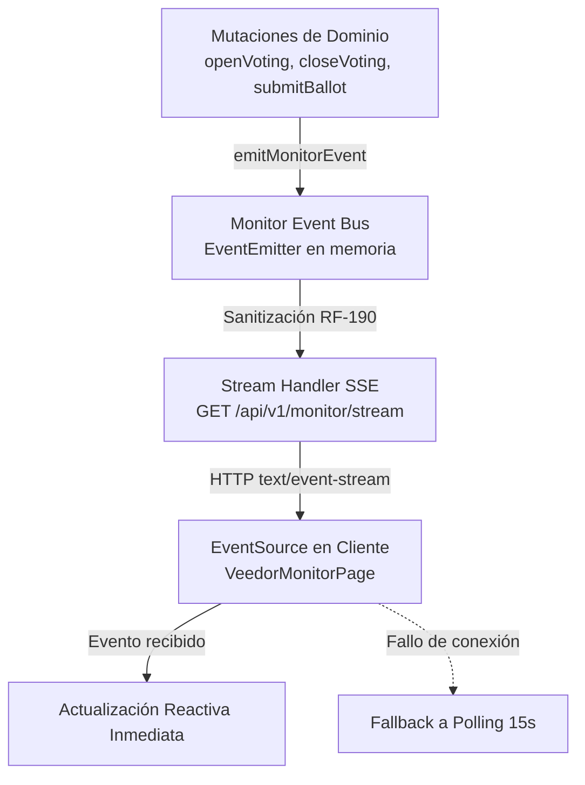

# Plan Técnico — Spec 022: Tiempo Real Interno (SSE)

## Arquitectura de la Solución

## Componentes y Cambios

### 1. `api/src/modules/monitor/monitor-event-bus.js`
- Exporta:
  - `emitMonitorEvent(event)`: sanitiza el evento asegurando que no contenga puntajes ni datos individuales de jurados y lo difunde a los suscriptores.
  - `subscribeMonitorEvents(handler)` y `unsubscribeMonitorEvents(handler)`.
  - `FORBIDDEN_FIELDS`: lista negra estricta (`score`, `scores`, `evaluationState`, `judgeName`, `judgeEmail`, `documentNumber`) con rechazo o remoción inmediata.

### 2. Integración en Servicios de Dominio
- `api/src/modules/ballots/ballot-service.js`:
  - En `openVoting`: emitir `VOTING_OPENED` con `{ eventId, nightId }`.
  - En `closeVoting`: emitir `VOTING_CLOSED` con `{ eventId, nightId, autoSubmitted }`.
  - En `closeVoting` ante error `VOTING_CLOSE_INCOMPLETE_BALLOTS`: emitir anomalía `CLOSE_ATTEMPT_INCOMPLETE` con `{ eventId, nightId, pendingCount: pending.length }`.
  - En `submitBallotLocked`: emitir `BALLOT_SUBMITTED` con `{ eventId, nightId, ballotId }`.
- `api/src/modules/results/results-service.js`:
  - En `releaseResults`: emitir `RESULTS_RELEASED` con `{ eventId }`.
- `api/src/modules/scrutiny-records/scrutiny-record-service.js`:
  - En `issueScrutinyRecord`: emitir `OFFICIAL_RECORD_EMITTED` con `{ eventId, recordId }`.

### 3. Ruta SSE en `api/src/routes/monitor.routes.js`
- `GET /api/v1/monitor/stream`:
  - Guard: `[requireSession, requireTwoFactor, requireVotingObserver]`.
  - Configura cabeceras:
    - `Content-Type: text/event-stream`
    - `Cache-Control: no-cache, no-transform`
    - `Connection: keep-alive`
    - `X-Accel-Buffering: no`
  - Envía evento inicial: `event: connected\ndata: {"status":"connected"}\n\n`.
  - Intervalo de ping cada 25 segundos: `: ping\n\n`.
  - Suscripción al bus y despacho de eventos formateados.
  - Limpieza en `request.on("close")`.

### 4. Cliente: `client/src/pages/VeedorMonitorPage.jsx`
- Conexión vía `EventSource`:
  - Escucha eventos `monitor_update` y `anomaly`.
  - Dispara `refresh()` inmediato.
  - Si `EventSource` entra en error, activa fallback a `setInterval(refresh, 15000)` y marca insignia `○ Polling de respaldo`.
  - Al recibir mensaje por SSE, apaga el intervalo y marca `● En vivo`.
- Modo "Pared de Sala" (`wallboardMode`):
  - Botón "Modo Pared" / "Pantalla Normal".
  - Clase `.is-wallboard` que maximiza legibilidad a distancia.
- Alertas de anomalía:
  - Banner accesible destacado ante anomalías reportadas (`CLOSE_ATTEMPT_INCOMPLETE`).

### 5. Estilos en `client/src/styles/components.css`
- Reglas para `.monitor-page.is-wallboard`.
- Reglas para insignias `.connection-status.is-live` y `.connection-status.is-polling`.
- Reglas para banners de anomalía `.anomaly-alert-banner`.
