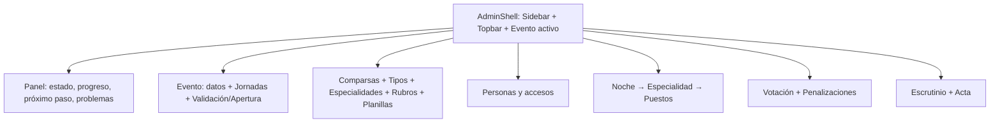
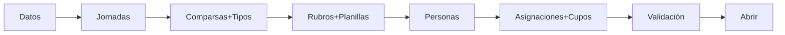

# Plan — Spec 027: Rediseño UX del Panel Administrador

## 1. Estrategia

Presentación + navegación + jerarquía + interacción + copy. Cero cambios de negocio. Fases pequeñas y verificables que evolucionan componentes existentes (`AppNavigation`, `Dialog`, `Button`, `StatusPill`, `PageShell`, `EventReadinessPanel`) sin duplicarlos.

## 2. Fases

- **Fase A — Fundaciones:** `ConfirmDialog`, `EntityDrawer`, `PageHeader`, `EventStatusBanner`, helper `admin-ux-labels`; CSS aditivo; migrar `EventReadinessPanel` de `window.confirm` a `ConfirmDialog`.
- **Fase B — Dashboard:** `AdminHomePage` de solo lectura (readiness + conteos) + `ConfigurationProgress`.
- **Fase C — Config básica:** jornadas/comparsas/tipos/especialidades a lista/tabla + drawer (`NightForm`, `TroupeForm`).
- **Fase D — Competencia:** `RubricTree`/`RubricEditor` + metadata colapsada + `EvaluationMatrix` con Resolver.
- **Fase E — Personas y asignaciones:** filtros + `ConfirmDialog`; board Noche→Especialidad + cupo inline + `JudgeAssignmentDialog` con disclosure + menú Acciones.
- **Fase F — Operación/cierre:** Voting a `Dialog` + banner OPEN; readiness navegable; polish penalizaciones/escrutinio/acta.
- **Fase G — Polish + a11y:** tokens, teclado/contraste/3 viewports.

## 3. Reglas por fase

Rutas hash intactas; `OPEN` lectura + banner; motivos obligatorios en acciones excepcionales; segregación ADMIN/escrutinio intacta; cada task con tests + suite + build + `git diff --check`.
